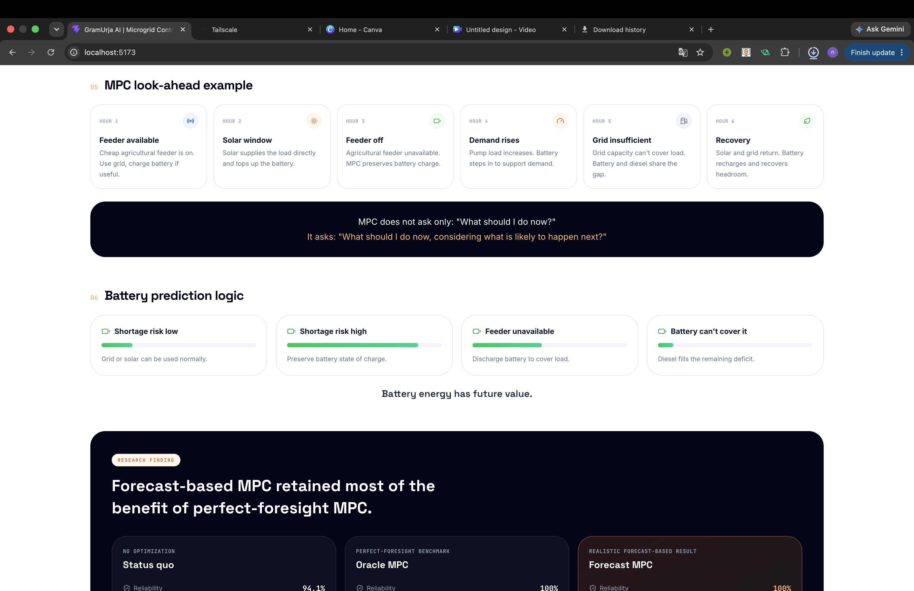
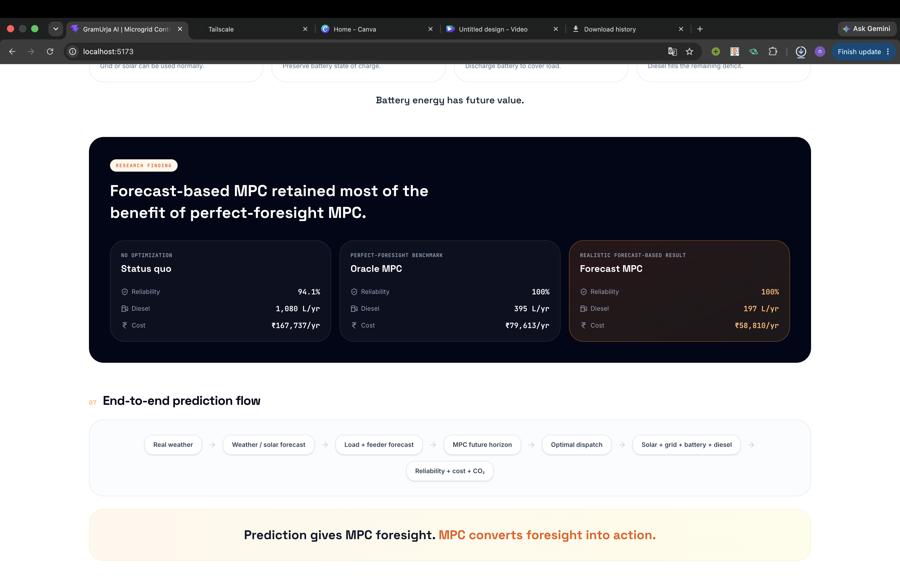

# GramUrja AI — Complete Project Explanation

[PROJECT_STARTUP.md](PROJECT_STARTUP.md) · [CONSOLE.md](CONSOLE.md)

A guide to what this project is, how it works, what the numbers mean, and what it does not
yet do. Written for teammates, judges and evaluators.

---

## Read this first

**In one sentence:** GramUrja AI decides what energy hardware a rural farm should install,
and then how to run it hour by hour — choosing between solar, battery, two different grid
feeders and diesel so the bill is as low as possible while the power stays on.

**The result**, on a full year of hourly simulation at a Banaskantha farm:

| | Today | With GramUrja AI |
|---|---|---|
| Diesel | 1,080 L/year | **184 L/year** (−83%) |
| Total energy cost | ₹167,737/year | **₹84,709/year** (₹83,027 saved) |
| Reliability | 94.1% | **100%** |
| CO₂ | 12,166 kg/year | **8,290 kg/year** (−31.9%) |

Recommended system: **3 kWp solar, 5 kWh battery, no wind** — derived from the load profile,
not assumed.

**Three things that make this more than a simulation:**

1. **The optimiser changes what hardware is worth buying.** Run the same sizing search under
   simple rules and it buys *no battery at all*; run it under our optimiser and the battery
   pays for itself and nearly doubles the diesel displaced. The controller has capital
   consequences, not just operating ones.
2. **It survives imperfect forecasts.** 88% of the perfect-foresight advantage remains when
   the controller plans on forecasts carrying this site's genuinely measured 17.5% error —
   and that forecast was itself validated against real archived weather predictions.
3. **Wind was evaluated, not assumed away — and rigorously.** It loses at Palanpur on
   measured physics (1.2% capacity factor), and after a scaling bug was found and fixed in
   the sizing search, a full retest at real village scale, at a genuinely windy coastal site,
   with a tall shared mast and a near-free price, still did not select it (Section 10). The
   model follows the economics wherever they lead, including to an answer that isn't the
   flattering one.

**The uncomfortable one, stated upfront:** roughly half the diesel reduction comes from
replacing an inefficient diesel pumpset with a proper generator — no AI involved. What the
optimiser adds on top is ₹18,867/year and 184 L of diesel beyond what simple rules achieve on
identical hardware.

**Where to go next:** Section 13 for all results · Section 3 for how the optimiser differs
from rule-based control · Section 12 for what is real data and what is assumed · Section 16
for the agents built and Section 17 for the final evaluation summary · Section 18 for
limitations.

---

## See it before you read it — the Prediction & Forecasting page

Screenshots of the live app (`/` route — the Prediction page), showing the actual pipeline
described in this document end to end, not a mockup.

**The pipeline, start to end** — real historical weather in, a forecasting layer with a
measured error, the MPC's future-looking horizon, and the four resources it dispatches:


**What the model predicts, and what's real data vs. a modelled assumption** — solar,
load, feeder availability and battery need are all forecast; Open-Meteo weather is real,
load and tariff profiles are documented model inputs, not live meter readings:


**Forecast accuracy, honestly reported** — a measured ~17.5% mean absolute error against
historical weather, used in testing instead of assuming perfect foresight:


**Why the forecast matters, and the MPC look-ahead in action hour by hour** — reacting to
current conditions alone vs. planning ahead for a known feeder outage or demand spike:



**The result** — forecast-based MPC keeps almost all of the benefit a perfect-foresight
oracle would get, at a fraction of the diesel and cost of doing nothing:



---

## 1. Project overview

### What GramUrja AI is

GramUrja AI is a **microgrid energy-mix optimiser**. Given a farm's energy demand, its solar
and wind resource, the grid connections available to it, and a diesel backup, it decides
**how much of every hour's load should come from each source** so that the total cost is as
low as possible while the supply stays reliable.

It is a decision engine, not a piece of hardware. It answers two questions:

- **What to install** — how many kWp of solar, how many kWh of battery, whether wind is
  worth it at all.
- **What to run, hour by hour** — when to charge the battery, when to spend it, when to
  import from which feeder, when to start the diesel.

### The problem it solves

A Banaskantha farm today runs on two separate electricity supplies and a diesel engine:

- A **5 HP diesel pumpset** drives irrigation. It is a direct-coupled engine turning a pump
  shaft, so it cannot power anything else — not a milking machine, not a cold store.
- The **agricultural feeder** is three-phase but rationed to about eight hours a day.
- The **village feeder** is near-continuous but single-phase and small.

The result is expensive and unreliable. In the modelled year the farm burns **1,080 litres
of diesel**, spends **₹167,737** on energy, and **892 kWh of demand goes unserved** because
when the agricultural feeder is down the village feeder cannot carry the pump.

### The complete system flow

```
Weather (solar & wind resource)  +  Farm load  +  Feeder availability
                              ↓
                        Forecasting
                              ↓
                 Optimisation engine (MPC)
                              ↓
       Solar · Wind · Grid feeders · Battery · Diesel
                              ↓
                       Farmer's loads
                              ↓
             Measurement, then re-optimisation
```

### What exists and what does not

| Component | Status |
|---|---|
| Hourly microgrid simulation | **Built** |
| Reanalysis weather → solar and wind output | **Built** |
| Forecasting of generation, demand, feeder availability | **Built** |
| Receding-horizon dispatch optimiser | **Built** |
| Hardware sizing search | **Built** |
| Carbon-aware optimisation | **Built** |
| Irrigation-window search and farmer briefing | **Built** |
| Farmer message in Gujarati and Hindi, with number verification | **Built** |
| Operator dashboard, and a live console with an HTTP API | **Built** |
| Community energy sharing between participants | **Built** |
| Autonomous agent orchestration | **Built** |

Everything reported in this document comes from the built components. Two honest
qualifications: there is **no trained machine-learning model** anywhere in the codebase --
forecasting is statistical and calibrated to measured error -- and the language model is
confined to phrasing the advice, never to computing it. Autonomous orchestration, where an
agent decides on its own when to re-plan, is designed but not written.

---

## 2. How the current system works

### Weather

Solar and wind come from **Open-Meteo's ERA5 reanalysis** for Palanpur, Banaskantha
(24.17°N, 72.43°E), for calendar 2025 — 8,760 hourly values.

An important honesty point: reanalysis is **not** a weather station reading. It is a physics
model that assimilates real observations onto a grid of roughly 9–30 km cells. It is
observation-grounded and is the standard source for studies like this, but it is not a
pyranometer standing in a field at Palanpur. A site survey would be the next step before
anyone spends money.

Grounding the model in reanalysis mattered. The synthetic profiles it replaced overstated
**solar yield by about a third** and **wind by an order of magnitude**.

### Solar generation

Irradiance and air temperature are converted to AC output with a temperature-derated PV
model — panels lose roughly 0.4% of output per °C above 25 °C, and Banaskantha runs hot, so
a 45 °C afternoon costs around 8% of nameplate.

**Measured yield: 1,490 kWh per kWp per year.**

### Wind generation

Wind speed at the 10 m reanalysis height is sheared up to hub height and passed through a
turbine power curve (cut-in 3 m/s, rated 12 m/s).

**At Palanpur: mean wind 2.5 m/s, capacity factor 1.2%.** A 3 kW turbine would produce
327 kWh in a year. Wind is modelled and fully supported, but the recommended system for this
site contains **0 kW of it**. Section 10 explains where it does get selected.

### Farm load

Hourly demand totalling **15,175 kWh a year**, made of:

- **Irrigation pump** — 5 HP (3.73 kW), about 640 run-hours a year, seasonal: roughly three
  hours a day in the rabi season, two in summer, half an hour during the monsoon.
- **Household** — 0.4 kW base with an evening rise.
- **Dairy** — 1.2 kW during morning and evening milking.
- **Cold storage** — 0.8 kW, running most of the day.

**This demand profile is constructed, not metered.** It is the largest modelled assumption
in the project, and cold storage alone drives roughly 40% of the annual total.

### The two feeders

Gujarat's Jyotigram scheme separates rural supply into two distinct feeders, and that split
governs the whole problem.

| | Agricultural feeder | Village feeder |
|---|---|---|
| Purpose | Irrigation pumping | Homes, dairy, small loads |
| Phase | Three-phase | Single-phase |
| Capacity (modelled) | 10 kW | **3 kW** |
| Tariff (assumed) | ₹1.50/kWh | ₹5.00/kWh |
| Availability (modelled) | ~31% — a rostered 8 h block | ~93% — near-continuous |

### Per-feeder constraints — why this matters so much

Each feeder is modelled as its own connection with its own cap. This is not a detail. **The
pump draws 3.73 kW and the village feeder can deliver 3 kW.** So when the agricultural
feeder is down, the pump *physically cannot* fall back on the domestic supply. That single
constraint is what creates the shortfall the battery and diesel exist to cover — and
separating the feeders is exactly why Jyotigram exists.

### Feeder availability

The agricultural feeder follows a **published rotating roster**: an eight-hour block whose
start time rotates weekly through **three slots — 06:00, 14:00 and 22:00**. On top of the
schedule, about 5% of hours are lost to **unplanned outages**.

That split is deliberate and important for forecasting: the **roster is knowable in advance**
and the **unplanned outages are not**. The village feeder is nominally continuous with
roughly 7% of hours lost to unannounced interruptions.

### Battery

5 kWh usable capacity in the recommended system, with:

- a **20% reserve floor** (1 kWh held back),
- charge and discharge limited to **1.25 kW** (a C/4 rate),
- **95% efficiency each way**, so a **90% round trip** — storing a kWh and getting it back
  costs about 11% extra.

That 10% loss turns out to matter a great deal for carbon (Section 6).

### Diesel backup

Two very different machines, which must not share one efficiency number:

| | Fuel rate | Cost per kWh | CO₂ per kWh |
|---|---|---|---|
| Direct-coupled pumpset (status quo) | 0.75 L/kWh | **₹73.79** | 2.03 kg |
| Proper backup genset (new system) | 0.30 L/kWh | **₹29.52** | 0.81 kg |

A small direct-coupled pumpset really is this inefficient, and it is why the status quo is
so expensive. Diesel is priced at ₹98.39/L and emits 2.7 kg CO₂ per litre.

### Reliability constraint

Unserved load carries a very high penalty in the optimiser (₹100/kWh, far above diesel's
₹29.52), so it will always burn fuel rather than shed load. In sizing, any configuration
that fails to hold **99% reliability** is rejected outright.

Result: the status quo serves 94.1% of demand; every recommended system serves **100%**.

### Cost optimisation

The optimiser minimises the total rupee cost of meeting demand — grid imports at each
feeder's own tariff, diesel at its fuel cost, plus penalties for unserved load. In sizing,
capital cost is added, recovered over each asset's life.

### Carbon-aware optimisation and time-varying grid intensity

Carbon can be priced into the same objective. Crucially, the **grid's carbon intensity
varies through the day**:

| Hour | Grid intensity |
|---|---|
| 13:00 (utility solar peak) | **0.515 kg/kWh** |
| 00:00–04:00 (coal baseload) | ~0.735 kg/kWh |
| 20:00 (evening peak) | **0.890 kg/kWh** |
| Annual mean | 0.710 kg/kWh |

A 73% spread between cleanest and dirtiest hour. Section 6 explains why that shape is the
only reason a battery can help emissions at all.

---

## 3. MPC vs RBC

### The two terms

- **RBC = Rule-Based Control.** Fixed if-then rules.
- **MPC = Model Predictive Control.** Look ahead, plan, act, repeat.

### How RBC decides

RBC looks only at *right now*. Its logic is essentially: use renewable energy if it's
available; if not, take the cheapest source available this instant; if there's surplus, store
it. It has no idea what happens next hour. It is simple, robust, and it is what most real
controllers do today.

### How MPC decides

Every hour, MPC:

1. Reads the current state — battery charge, current load, what's available.
2. Looks **24 hours ahead** at forecast demand, forecast solar, the feeder roster, tariffs
   and carbon intensity.
3. Solves for the cheapest 24-hour plan that meets every constraint.
4. **Applies only the first hour** and discards the rest.
5. Next hour, re-solves with updated information.

That last part matters: it never commits to a stale plan. If the forecast was wrong, the next
solve corrects for it.

### Why MPC preserves the battery

Because it knows what's coming. A kWh in the battery is not worth what it would save *now* —
it's worth what it will save **when it is finally used**. If the cheap feeder is on now, that
kWh only displaces ₹1.50 power. But if the feeder goes down during tonight's pump run, the
same kWh displaces **₹29.52 diesel**. MPC holds it for the second case. RBC cannot, because
it doesn't know tonight exists.

### Why MPC uses cheap grid power

For exactly the same reason. When the ₹1.50 feeder is on, buying from it is cheaper than
spending stored energy that is worth far more later. So MPC buys grid power *and* charges the
battery at the same time — building up a reserve precisely when energy is cheapest.

### Why MPC spends the battery during outages

When the agricultural feeder is down and the pump is running, the village feeder is capped at
3 kW against a 5.81 kW load. The only remaining options are the battery and diesel. Stored
energy is now worth ₹29.52/kWh, so MPC discharges at full rate and lets diesel cover only
what's left.

### Verified behaviour

Over 30 simulated days, the built optimiser showed:

| Behaviour | Result |
|---|---|
| Hours discharging while the ₹1.50 feeder was **up** | **0** |
| Hours discharging while it was **down** | 342 |
| Hours holding usable charge while importing from the cheap feeder | 200 |
| Share of charging done inside the cheap window | **85%** (117 of 137 kWh) |

A perfect separation: the battery is *never* spent while cheap power is available.

---

## 4. The feeder example

### The two-feeder concept

Think of the farm as having two electricity taps:

- **The agricultural tap** — big enough for the pump, but only open on a schedule.
- **The village tap** — always open, but too small for the pump.

### The modelled roster — and what it is not

This project models the agricultural feeder as an **eight-hour block rotating weekly through
three start times: 06:00, 14:00, 22:00**, plus random unplanned outages.

**This is the project's modelled example, not an official statewide rule.** Real Jyotigram
schedules differ by district and feeder and change over time. What the model is trying to
capture is the *structure* that matters: supply is **scheduled and therefore predictable**,
with an **unpredictable failure rate on top**. A real deployment would use the actual
published roster for that feeder.

### How availability is forecast

The controller predicts feeder availability by simply reading the roster — the schedule is
published, so no clever prediction is needed. What it **cannot** foresee is an unplanned
outage. For the village feeder, which has no schedule, the controller assumes supply will be
there and is occasionally surprised.

This split is deliberate: it tests forecasting where forecasting is genuinely hard, rather
than giving the controller knowledge it wouldn't have.

### Hour-by-hour behaviour

**Agricultural feeder available** → serve load from grid and solar; **charge** the battery
with the surplus. Do not discharge — stored energy is worth more later.

**Agricultural feeder unavailable, village available** → serve from solar and the village
feeder up to its 3 kW cap; discharge the battery only for what the village feeder cannot
carry.

**Both feeders unavailable** → solar, then battery, then diesel for the remainder.

**Pump running with the agricultural feeder down** → the village feeder's 3 kW cannot carry a
3.73 kW pump. Battery and diesel must cover the gap. There is no way around this; it is a
physical limit, not a cost preference.

### Why the battery is saved

A battery holds a limited amount of energy. Spending it while a ₹1.50 feeder is available
buys a ₹1.50 saving. Holding it until the feeder is down buys a ₹29.52 saving. Same kWh,
nearly twenty times the value. The only reason to spend early is if it would otherwise sit
full and waste incoming solar.

---

## 5. A simple MPC example

These are **real timesteps** from the model, not an invented illustration. `ag` is the
₹1.50 feeder, `vil` the ₹5.00 feeder (3 kW cap), `soc` is battery state of charge with a
floor at 0.20.

```
hour  load  pump  solar agUp    ag   vil   chg   dis   soc   dsl
 149  2.08  0.00   0.00    0  0.00  2.08  0.00  0.00  0.20  0.00
 150  2.08  0.00   0.00    1  2.70  0.00  0.62  0.00  0.20  0.00
 151  5.81  3.73   0.00    1  6.19  0.00  0.38  0.00  0.32  0.00
 161  2.40  0.00   0.43    0  0.00  1.90  0.00  0.07  0.96  0.00
 162  2.90  0.00   0.05    0  0.00  2.81  0.00  0.04  0.95  0.00
 163  2.58  0.00   0.00    0  0.00  0.00  0.00  1.19  0.94  1.39
 175  5.81  3.73   0.00    0  0.00  3.00  0.00  1.19  0.89  1.62
 176  4.71  3.73   0.18    0  0.00  3.00  0.00  1.19  0.64  0.34
 177  4.71  3.73   0.67    0  0.00  3.00  0.00  0.88  0.39  0.16
 178  1.30  0.00   1.12    0  0.00  0.18  0.00  0.00  0.20  0.00
```

**Hour 149 — feeder down.** Load 2.08 kW served entirely by the village feeder at ₹5.00.
Battery sits at its 0.20 floor and legally cannot discharge.

**Hour 150 — the feeder comes on.** Village import drops instantly to zero; the farm pulls
2.70 kW from the ₹1.50 feeder for a 2.08 kW load. The extra 0.62 kW **charges the battery**.
It abandons the expensive tap the moment the cheap one opens, and starts stockpiling.

**Hour 151 — the pump starts, and the battery still charges.** Load jumps to 5.81 kW. The
battery has energy, but MPC imports 6.19 kW and keeps charging. *Why?* Discharging now saves
₹1.50/kWh. That same kWh is worth ₹29.52 later. It buys rather than spends.

**Hours 161–162 — holding the line.** Battery is nearly full (0.96), the cheap feeder is
down, and MPC *still* buys from the ₹5.00 village feeder rather than draining storage. It is
saving it for something.

**Hour 163 — the something.** The village feeder fails too. No grid at all, 2.58 kW of load.
Battery discharges at its 1.19 kW maximum, diesel covers the remaining 1.39 kW. Without the
reserve, all of it would have been diesel.

**Hours 175–177 — the big one.** The pump runs with the agricultural feeder down. Village is
pinned at exactly **3.00 kW, its hard cap**, and the pump alone wants 3.73 kW. The battery
discharges flat out (1.19, 1.19, 0.88) and diesel fills only the remainder. State of charge
drains 0.89 → 0.20, hitting the floor exactly as the pump stops.

Nothing was wasted and nothing was spent early. That is the whole mechanism.

---

## 6. Battery intelligence

### Why stored energy is not spent on sight

A battery is not a free energy source — it is a **timing device**. Every kWh in it was paid
for, and using it now means not having it later. The right question is never "is there energy
in the battery?" but "**is now the most valuable moment to use it?**"

### What "future value" means

The value of a stored kWh equals the cost of whatever it will displace:

| Displaces | Worth |
|---|---|
| Agricultural feeder power | ₹1.50/kWh |
| Village feeder power | ₹5.00/kWh |
| Diesel | **₹29.52/kWh** |

MPC holds the battery for the highest-value moment it can see in its 24-hour window.

### What it weighs

Future load (especially pump hours), forecast solar, the feeder roster, unplanned-outage
risk, tariffs, carbon intensity, and the battery's own limits — the 20% floor, the 1.25 kW
rate cap, the 90% round-trip efficiency.

### Carbon-aware battery dispatch

If carbon is given a price, the optimiser also weighs the emissions of each option. Whether
that changes anything depends entirely on one thing: **does grid carbon vary over time?**

### Why flat carbon creates no arbitrage

Suppose the grid emitted a constant 0.71 kg/kWh. Discharging a stored kWh to avoid grid
carbon saves 0.71 kg now — but you must re-import that kWh later, and the 90% round trip
means importing 1.11 kWh to restore it, emitting 0.79 kg. **Net: 0.08 kg worse.**

This was tested. With flat intensity, even at a carbon price of **₹50/kg** — roughly ten
times the social cost of carbon — the optimiser **never once** discharged the battery to
avoid grid carbon, and total emissions moved by under 1%. A battery can only arbitrage
things that *change*. Flat carbon doesn't change, so there is nothing to trade.

### Why time-varying carbon does create arbitrage

With a real daily shape, the trade becomes profitable: store a kWh at 13:00 when the grid is
at 0.515 kg/kWh, release it at 20:00 when it is 0.890. That saves 0.375 kg — comfortably more
than the ~0.08 kg the round trip costs.

Measured over 30 days with time-varying intensity:

| Carbon price | Charging in clean midday | Discharging in dirty evening | CO₂ |
|---|---|---|---|
| ₹0/kg | 51.3 kWh | 27.3 kWh | 821 kg |
| **₹2/kg** | **112.0 kWh** | **74.2 kWh** | **801 kg** |
| ₹5/kg | 114.9 kWh | 76.9 kWh | 800 kg |
| ₹50/kg | 123.7 kWh | 89.7 kWh | 797 kg |

Almost the entire behavioural shift happens between ₹0 and ₹2. That matters practically:
India's carbon market trades near ₹2/kg, so this is reachable under existing policy rather
than requiring a hypothetical price.

---

## 7. Sizing optimisation

### The question

How much solar, wind and battery should actually be installed? Guessing is easy to get
wrong — the project's original placeholder of 10 kWp solar and 20 kWh of battery turned out
to be roughly three times too large and threw away 40% of what it generated.

### Why it must be a sweep

Each candidate configuration behaves differently in ways that interact and cannot be
reasoned about in isolation: capital cost, generation, how hard the battery gets cycled,
diesel consumption, reliability and emissions. The only honest way to compare them is to
**run each one**.

So the search:

1. Enumerates combinations of solar × wind × battery.
2. Simulates **every one over the full 8,760-hour year** with the real controller.
3. Costs each: capital recovered over each asset's life (25 years solar, 20 wind, 10 battery,
   at a 9% discount rate) plus fuel, grid and O&M.
4. Discards anything below 99% reliability.
5. Picks the cheapest survivor.

Because each candidate is scored by running the actual controller, **the answer depends on
which controller runs** — see Section 13.

### The result (reanalysis weather, realistic forecasts, 120 configurations)

**Recommended: 3 kWp solar · 0 kW wind · 5 kWh battery**

| Metric | Value |
|---|---|
| Diesel | 184 L/year (83.0% below status quo) |
| Reliability | 100% |
| Annualised capital | ₹31,695 |
| Energy cost | ₹53,014 |
| **Total** | **₹84,709/year** |
| Curtailed energy | 19 kWh/year |

Nearby options, showing how flat the cost surface is:

| Solar | Battery | Diesel | Diesel cut | Total/year |
|---|---|---|---|---|
| **3 kWp** | **5 kWh** | 184 L | 83.0% | **₹84,709** |
| 2 kWp | 5 kWh | 198 L | 81.6% | ₹85,055 |
| 3 kWp | 10 kWh | 75 L | 93.1% | ₹86,218 |
| 0 | 10 kWh | 107 L | 90.1% | ₹88,353 |
| 2 kWp | 0 | 396 L | 63.4% | ₹90,827 |

The top dozen configurations sit within 7% of each other, so the recommendation is robust
rather than knife-edge. Note the third row: **₹1,460/year more buys a 10 kWh battery and
lifts the diesel cut from 83% to 93%**.

---

## 8. The village case

The problem statement asks about **off-grid communities**, and names microgrid operators,
electrification agencies and NGOs as its users — not individual farmers. So the same engine
was pointed at a whole village rather than one holding.

### What the village contains

100 households, 20 farms, a dairy chilling centre and the drinking-water supply.

| Load | kWh/year | Share | Character |
|---|---|---|---|
| Households | 91,271 | 58.0% | Small individually, evening peak |
| Irrigation | 44,350 | 28.2% | Large, scheduled, deferrable |
| Dairy chilling | 16,206 | 10.3% | Twice daily, **hard deadline** |
| Water supply | 5,446 | 3.5% | Critical but shiftable |
| **Total** | **157,273** | | Peak 49.9 kW, load factor 36% |

### A village is not one farm multiplied

Two things change, and both matter.

**Diversity.** A hundred households do not switch on together, and twenty pumps do not start
in the same minute. Each farm in the model has its own fixed start hour, so the aggregate
pump peak is **29.8 kW against the 74.6 kW they would draw simultaneously — a diversity
factor of 0.40**. That spread is the whole economic argument for sharing infrastructure, and
a model that multiplies one farm by twenty throws it away.

**The peak moves to the evening.** On a single farm the dominant load is a pump running in
daylight, so demand and solar roughly coincide. In a village, households dominate and peak at
**31 kW at 19:00** when solar is zero, against a **10.9 kW trough at 13:00** when solar is
strongest. That mismatch is precisely what storage exists to fix.

### The routing constraint

At farm scale, the rule that pumps cannot use the domestic feeder came for free: a 3 kW
single-phase connection physically cannot start a 3.73 kW pump. A 50 kW village transformer
can, so at village scale the rule has to be stated explicitly.

It is a real constraint, not a modelling convenience. Agricultural and domestic supplies are
**separately sanctioned and separately tariffed** — ₹1.50 against ₹5.00 — and running a pump
off a domestic connection is a different contract, not a clever optimisation. The optimiser
now carries demand as two groups with a separate energy balance each, and every connection
declares what it may serve. Grid power may only reach the battery through a connection
already allowed to serve the domestic side; otherwise storage becomes a laundering route for
agricultural-tariff power.

**Enforcing it changed the answer completely:**

| | Without routing | **With routing** |
|---|---|---|
| Solar | 20 kWp | **40 kWp** |
| Battery | **0 kWh** | **100 kWh** |
| Diesel | 2,014 L | **937 L** |
| CO₂ cut | 33.0% | **47.7%** |
| Saved per household | ₹19,244 | **₹16,524** |

Storage went from worthless to essential. Once pumps genuinely cannot fall back on the
domestic feeder, the roughly 69% of hours when the agricultural feeder is down must be
covered by solar, battery or diesel — and storage is the cheapest way to do it. **Every one
of the ten cheapest configurations now carries a battery**, the smallest being 25 kWh.

The earlier ₹19,244 per household was inflated because the model was quietly supplying pumps
from a domestic connection. The honest figure is about 14% lower.

### Result

**Recommended: 40 kWp solar, 0 kW wind, 100 kWh battery**

| Metric | Status quo | Recommended |
|---|---|---|
| Diesel | 21,970 L/year | **937 L/year** (−95.7%) |
| Total cost | ₹2,707,313/year | **₹1,054,954/year** |
| Reliability | 94.7% | **100%** |
| Unserved load | 8,306 kWh/year | **0** |
| CO₂ | 149,246 kg/year | **78,116 kg/year** (−47.7%) |

**Saving: ₹1,652,359/year — ₹16,524 per household.**

The nearest alternatives:

| Solar | Battery | Diesel | Renewable share | Total/year |
|---|---|---|---|---|
| **40 kWp** | **100 kWh** | 937 L | 36.8% | **₹1,054,954** |
| 30 kWp | 50 kWh | 2,680 L | 27.5% | ₹1,063,273 |
| 40 kWp | 50 kWh | 2,555 L | 33.7% | ₹1,068,275 |
| 30 kWp | 100 kWh | 1,114 L | 28.0% | ₹1,077,758 |
| 60 kWp | 100 kWh | 826 L | 48.0% | ₹1,084,170 |

Two consistency checks worth noting. Status-quo diesel works out to **1,098 L per farm**
against 1,080 L from the independent single-farm run — within 1.7%, from a completely
different load model. And the village needs 100 kWh of storage where a single farm needed
5 kWh; with 20 farms that is suggestive rather than rigorous, since the village also carries
100 households, but the two models landing in the same territory from different directions is
reassuring.

**Caveat:** every figure in the village load model is an assumption — 2.5 kWh/day per
household, a 5 kW bulk milk cooler, four hours of water pumping. Structurally realistic for
Banaskantha, but none of it is metered.

---

## 9. Sharing surplus between neighbours

The village model in section 8 puts every load on one bus, which quietly assumes sharing is
already perfect and free. You cannot price something you have assumed, so this asks the
question properly: model the village as its actual participants, and run it twice with only
one thing different.

### The participants are deliberately unalike

That asymmetry is where sharing gets its value.

| Participant | Share of demand | Owns | Connection |
|---|---|---|---|
| 20 farms | 61.7% | the panels, the batteries, the pumpsets | agricultural **and** domestic |
| 100 households | 31.0% | **nothing** | domestic only |
| Dairy chilling centre | 5.5% | nothing | domestic only |
| Water supply | 1.8% | nothing | domestic only |

Households are nearly a third of village demand and own none of the generation. A household
may not draw agricultural-tariff power, and has no backup at all -- so when the domestic
feeder fails, it simply goes without.

Two things stop the shared case being free by construction, which is the trap in this kind
of experiment: energy crossing the line loses 3% to distribution, and every connection has
a capacity limit. Without both, sharing costs nothing and the result means nothing.

### What a village line buys

60 days, Palanpur weather, 60 kWp of solar and 100 kWh of storage, all of it on the farms.

| Line | Diesel | Curtailed | Shared | Unserved | Reliability | Per kWh served |
|---|---|---|---|---|---|---|
| 0 kW (alone) | 1,153 L | 1,808 kWh | 0 | 1,394 kWh | 97.12% | Rs 5.38 |
| 1 kW | 265 L | **0** | 6,944 kWh | 827 kWh | 98.29% | Rs 3.25 |
| 2 kW | **154 L** | 0 | 9,933 kWh | 517 kWh | 98.93% | **Rs 2.91** |
| 4 kW | 312 L | 0 | 12,154 kWh | 131 kWh | 99.73% | Rs 3.11 |
| 8 kW | 370 L | 0 | 12,805 kWh | **0** | **100%** | Rs 3.19 |

**Waste ends at the first kilowatt.** 1,808 kWh of surplus was being curtailed while
neighbours burned diesel; one kilowatt of line removes all of it. Diesel falls 87% and the
cost of a delivered kWh falls 46%, from Rs 5.38 to Rs 2.91.

### Who was actually in the dark

The 1,394 kWh that went unserved without sharing breaks down as:

| | Unserved |
|---|---|
| Households | 1,149 kWh |
| Dairy chiller | 197 kWh |
| Water supply | 48 kWh |
| **Farms** | **0 kWh** |

The farms are absent from that list. They own the panels, the batteries and the pumpsets,
and they were never the ones going without. **Sharing is not mainly about saving farmers
money -- it is about the households and the milk cooler that had no backup at all.** As the
line grows, that column empties from the bottom up: households 1,149 to 680 to 411 to 103
to zero.

### Cheapest and fairest are not the same line

A 2 kW line is the cheapest per unit at Rs 2.91, and still leaves 517 kWh unserved. An 8 kW
line serves everybody for Rs 3.19, about 9% more -- and it deliberately burns *more* diesel,
370 L against 154 L, because reaching the last household is worth more than the fuel it
costs. Both rows are reported because that is a policy choice, not a technical one.

Either way the wire is small. Capacity stops being the binding constraint somewhere between
2 and 8 kW, so this is not an argument for expensive distribution infrastructure.

### Running it as one village

The sweep above prices the line. It does not show how the parts behave once the line is
there, so the same cluster was run once at 4 kW with every flow attributed to its owner.
27 metered connections covering 122 premises, one line, one battery fleet, one
optimisation, solved hour by hour.

| | Demand | Share | Unserved | Diesel |
|---|---|---|---|---|
| Farms | 29,868 kWh | 61.7% | 0.0 | 312 L |
| Households | 15,006 kWh | 31.0% | 103.3 kWh | 0 |
| Dairy chiller | 2,664 kWh | 5.5% | 28.0 kWh | 0 |
| Water pumping | 895 kWh | 1.8% | 0.0 | 0 |
| **Village** | **48,433 kWh** | **100%** | **131.3 kWh** | **312 L** |

99.73% of village demand served at Rs 3.11 per kWh, and no curtailment at all. The supply
mix is village feeder 39.2%, agricultural feeder 31.4%, own solar 28.6%, **diesel 0.8%**.

**The line runs both ways, which the sweep could not show.**

| | Exported | Imported | Net |
|---|---|---|---|
| Farms | 11,602 kWh | 4,121 kWh | **−7,481 kWh** |
| Households | 470 kWh | 6,310 kWh | +5,840 kWh |
| Dairy chiller | 65 kWh | 1,053 kWh | +988 kWh |
| Water pumping | 17 kWh | 306 kWh | +289 kWh |

The farms are the only net exporters -- they own every panel. But the households own *no
generation* and still push out 471 kWh, which needed a cause rather than a story.

The cause is **the farms' own domestic connection cap**. Each farm holds 2 kW on the
village feeder; each household block holds 12 kW and does not use all of it. When a farm's
domestic draw hits its own ceiling, a block imports on the farm's behalf and relays it
across the line. The test is decisive: **raise the farm cap from 2 kW to 6 kW and household
export falls to exactly zero**, with no other change.

So it is genuinely a two-way trade -- **farm solar by day, spare household connection
capacity when a farm is capped** -- and the farms do get something back, which is the
difference between a scheme people join and one they have to be talked into. But the
honest reading is that the relay is a *symptom*: it is a workaround for an undersized farm
connection, and over the same 20-day window, raising the cap costs ₹52,747 against ₹53,345
with the relay. **Upgrading the connection beats wheeling power around it.** That is a more
useful finding for an electrification agency than the trade itself.

> **How this was corrected.** An earlier version of this section claimed the mechanism was
> "household grid access during the Jyotigram ration", on the evidence that all 165 export
> hours had the agricultural feeder off. That correlation is real but incidental — during
> those hours a farm's draw shifts onto its domestic side and hits the 2 kW cap. The test
> suite flagged the per-participant attribution as under-determined, and checking it
> properly produced the cap explanation above. The numbers never moved; the explanation was
> wrong.

**Attribution caveat.** Nothing in the objective originally priced use of the line, so when
a surplus would otherwise be curtailed the optimiser was exactly indifferent about *who*
routed it — different solvers returned different per-participant splits at identical cost.
A small wheeling charge (₹0.01/kWh) now breaks that tie in the physically sensible
direction. With it, CLARABEL and ECOS agree on the per-kind flows to within 0.3%, and the
aggregates (transferred, unserved, cost, reliability) match to six significant figures
under every solver tried. **Which individual block relays is still not determined**, so
this table should be read by kind and never by participant.

The combined day, averaged over 60 days (kW):

| Hour | Demand | Solar | Ag feeder | Village feeder | Battery | Diesel | Shared |
|---|---|---|---|---|---|---|---|
| 02 | 13.5 | 0.0 | 6.0 | 8.1 | −0.5 | 0.0 | 1.4 |
| 07 | **65.3** | 0.1 | 25.0 | 34.1 | +6.5 | 0.0 | **14.3** |
| 12 | 28.5 | **33.7** | 4.4 | 0.1 | −9.3 | 0.0 | 11.5 |
| 20 | 47.9 | 0.0 | 16.3 | 30.2 | +0.8 | 0.5 | 9.2 |

Positive battery is discharge, negative is charge. The fleet charges 01--05, 10--17 and
23--24, and discharges 05--10, 17--21 and 22--23 -- two charge windows for two unrelated
reasons, the Rs 1.50 agricultural tariff overnight and free surplus solar at midday. At noon
the feeders nearly switch off, 4.4 kW and 0.1 kW against 33.7 kW of solar. The line peaks at
07:00 at 14.3 kW, above its 4 kW nameplate because that limit is per connection: 27 of them
each move their own share.

### Honest notes

This runs 60 days rather than a year, because the cluster program solves a balance for every
participant and is far heavier than the single-farm one. Read the ratios; the rupees are not
annual. Households are modelled in blocks of twenty rather than individually -- a hundred
separate participants would be slow and would imply a precision the load model does not
have. What matters for sharing is the mix of kinds, not the meter count. And as everywhere
else in this project, the load profiles are constructed, not metered.

---

## 10. The wind decision

### Why wind was rejected at Palanpur

Not on cost — on physics.

| Quantity | Measured | Consequence |
|---|---|---|
| Mean wind speed | 2.5 m/s | Below the 3 m/s turbine cut-in most of the year |
| Capacity factor | **1.2%** | A 3 kW turbine yields 327 kWh/year |
| Appearances in the optimum | **0 of 120** | Beaten by solar at every capacity and price |

Banaskantha is inland northern Gujarat. The state's wind resource is on the Kutch and
Saurashtra coast.

### The Dwarka experiment — revisited and corrected

An earlier pass of this project ran the same question at Dwarka village scale and reported
that wind entered the optimum below about ₹60,000/kW. That result was produced before a real
bug in the sizing search was found and fixed: the branch-and-bound agent's pruning bound
compared unscaled totals across horizons shorter than a year, which under-counted energy
cost relative to capital and could tip a close call the wrong way (see `search.py`'s
`horizon_scale` correction, and `tests/test_search.py` for the regression tests written
against it). The Dwarka table above is superseded by the exhaustive retest below, run on the
corrected code.

**The retest was deliberately harder to satisfy than the original claim.** Every factor that
could plausibly help wind was tested, separately and then stacked together, at both farm and
real village scale:

| Test | Configuration | Wind selected |
|---|---|---|
| Farm, default price | Palanpur, 18 m mast, ₹120,000/kW | **0 kW** |
| Farm, cheap price | Palanpur, 18 m mast, ₹55,000/kW | **0 kW** |
| Farm, near-free price | Palanpur, 18 m mast, ₹10,000/kW | **0 kW** |
| Farm, inflated demand | Same site, load scaled ~40×(diesel use jumped 40× in response) | **0 kW** |
| Village, default | 100 households + 20 farms + dairy + water, Palanpur, 18 m mast, ₹120,000/kW | **0 kW** |
| Village, best case for wind | Same village demand, **Dwarka coast**, **80 m shared mast**, **₹55,000/kW** — every favourable factor at once | **0 kW** |

The last row is the important one: it combines real village-scale demand, a genuinely windy
coastal site, a tall shared mast, and a price cheaper than the old ₹60,000/kW threshold — and
wind is still 0 kW in the recommended system and in every one of the top 5 candidates.
Recommended: **40 kWp solar, 0 kW wind, 100 kWh battery, ₹1,045,538/year at 100% reliability**
(365-day, full lattice) — reproduced live and interactively at a shortened 30-day horizon by
the `/api/village/size` endpoint the dashboard's "Village-Scale Validation" panel calls,
which returned the same recommendation (₹944,368/year at that horizon) in about 35 seconds.

**Why it loses even here.** A 20 kW turbine at ₹55,000/kW still carries roughly ₹150,000/year
in annualised capital and O&M just to own it, before it generates anything. The same test
also declined to add a battery — the winning system uses 100 kWh in the full-year run but,
at the 30-day interactive horizon, the cheapest system uses none at all; adding 50 kWh there
costs about ₹149,000/year more in capital but only saves about ₹142,000/year in displaced
diesel and feeder imports, a loss of roughly ₹7,000/year. Wind is being asked to solve the
same problem a battery already isn't quite worth solving, with a less flexible tool: a
battery can store any surplus and release it at the exact hour of shortfall, while wind can
only help if it happens to be generating during that shortfall, and the site's demand curve
doesn't line up well enough with when the wind actually blows.

**This is not "Dwarka has no wind."** Devbhumi Dwarka is a real utility-scale wind hub —
Tata Power, THDC and Apraava Energy all operate multi-megawatt wind farms on that coast. The
finding is about the gap between utility-scale and single-village-scale economics: a 2 MW
commercial turbine reaches economies of scale a 20 kW community turbine never will.

### The honest conclusion

Wind is evaluated on its economics at every scale this project tested, not assumed away and
not assumed in. At Palanpur it fails on physics (1.2% capacity factor, below cut-in speed
most of the year). At real village scale, at a genuinely windy coastal site, with a tall
shared mast and a price below what an earlier (buggy) version of this same search once
reported as its break-even point, it still does not pay for itself. The honest answer this
project currently supports is that small, single-village wind is not viable anywhere in the
demand and price ranges tested here — not a permanent claim about wind in Gujarat, but the
actual result of every test run against the corrected code.

---

## 11. Carbon-aware optimisation

### Cost-only versus carbon-aware

By default the optimiser minimises rupees. Carbon-aware mode adds emissions to the same
objective:

```
Total objective  =  energy cost  +  carbon price × CO₂ emitted
```

### What the carbon price actually represents

**The carbon price is a modelling parameter, not a bill.** It expresses how much the
decision-maker values avoiding a kilogram of CO₂. It can stand for a policy instrument, a
subsidy, an NGO's internal valuation, a social cost of carbon, or simply a planning
scenario.

**The farmer does not pay this price.** Nothing in the implementation charges it to anyone.
That is why the tables below separate the optimiser's internal objective from the farmer's
actual bill.

### Sensitivity results

| Carbon value | Solar | Battery | Diesel | CO₂ | CO₂ cut | Optimisation total | Farmer's bill | Abatement |
|---|---|---|---|---|---|---|---|---|
| ₹0/kg | 3 kWp | 5 kWh | 184 L | 8,290 kg | 31.9% | ₹84,709 | ₹84,709 | — |
| ₹2/kg | 3 kWp | 5 kWh | 197 L | 8,110 kg | 33.3% | ₹102,297 | ₹86,077 | ₹7.60/kg |
| ₹5/kg | 5 kWp | 10 kWh | 94 L | 6,349 kg | 47.8% | ₹124,446 | ₹92,701 | ₹4.12/kg |
| ₹15/kg | 8 kWp | 20 kWh | 34 L | 3,858 kg | 68.3% | ₹177,608 | ₹119,738 | ₹7.90/kg |

**Reading this table correctly:**

- **Optimisation total** is the objective's own value and *includes* the modelled carbon
  term. It is not money anyone pays.
- **Farmer's bill** removes that carbon term — capital plus energy only. This is the number
  to compare against the ₹167,737 status quo.
- **Abatement** is the extra rupees per kilogram of CO₂ avoided, measured against the ₹0 row.

### The key finding

Two distinct mechanisms operate, and they are worth separating:

**At ₹2/kg the hardware does not change at all.** Still 3 kWp and 5 kWh. The entire 180 kg
gain comes from the optimiser **re-timing the battery** against the daily carbon curve —
charging through the clean midday trough, discharging into the dirty evening peak. No
capital, pure dispatch.

**From ₹5/kg upward it buys capacity instead**, and capacity is the cheaper lever — ₹4.12/kg
against ₹7.60/kg for re-timing, because it removes far more carbon per rupee.

So: **installed renewable capacity is the dominant driver of emissions, but dispatch is not
irrelevant** — it contributes a real, if smaller, reduction once carbon intensity varies
through the day. Under a flat intensity assumption, dispatch contributes essentially nothing.

---

## 12. Real data versus modelled assumptions

Being precise about this is the difference between a defensible project and an
embarrassing one.

### Grounded in observation

| Item | Source | Note |
|---|---|---|
| Solar and wind resource | Open-Meteo **ERA5 reanalysis**, Palanpur 2025 | Observation-assimilated model on a ~9–30 km grid — **not** a weather station |
| Day-ahead forecast error | Open-Meteo's **archived past model runs**, 92 days | 17.5% mean absolute error on daylight irradiance — genuinely measured |
| Diesel price | Field research | ₹98.39/L |
| Pumpset fuel rate | Derived from field figures | 2.8 L/h over a 3.73 kW pump = 0.75 L/kWh |

### The forecast, precisely

This deserves care because it is easy to overstate.

- Annual runs use a **synthesised** forecast — the reanalysis irradiance perturbed with
  day-correlated noise scaled to the measured 17.5% error. It is **not** downloaded forecast
  data. Synthesis is necessary because the forecast archive reaches back only ~92 days.
- Genuine archived forecasts are used in **one place**: a 93-day validation run.
- That validation found the synthesised forecast reproduces **93% of the cost penalty** a
  real forecast imposes (₹517 against ₹557), making it very slightly optimistic.

| Forecast | Diesel | Cost | Penalty vs perfect foresight |
|---|---|---|---|
| Perfect foresight | 45.8 L | ₹15,065 | — |
| Archived, genuine | 51.9 L | ₹15,622 | ₹557 |
| Synthesised | 51.6 L | ₹15,582 | ₹517 |

### Modelled assumptions — not data

| Item | Value | Note |
|---|---|---|
| Farm demand profile | 15,175 kWh/year | **Constructed.** Cold storage alone is ~40% of it |
| Feeder roster | 8 h block, three rotating start times | Modelled example of Jyotigram structure |
| Feeder outage rates | 5% agricultural, 7% village | Assumed |
| Feeder tariffs | ₹1.50 and ₹5.00/kWh | Assumed |
| Feeder capacities | 10 kW and 3 kW | Assumed |
| Solar capital | ₹50,000/kWp | Planning assumption |
| Battery capital | ₹18,000/kWh | Planning assumption — **results are sensitive to this** |
| Wind capital | ₹120,000/kW farm, ₹70,000/kW community | Planning assumption |
| Asset lives / discount rate | 25 / 20 / 10 years at 9% | Assumed |
| Backup genset fuel rate | 0.30 L/kWh | Engineering assumption |
| Grid emission factor | 0.710 kg/kWh mean, varying 0.515–0.890 | Assumed shape and level |

**None of the second table is real data.** They are reasonable planning figures that a pilot
would replace.

---

## 13. Current results

### The three controllers

Same hardware (3 kWp solar, 5 kWh battery), same year, same weather. **These are energy costs
only — they exclude the ₹31,695/year of annualised capital**, so they are not comparable to
the ₹84,709 total in the next table.

| Metric | Status quo | Rule-based | Optimiser (realistic forecast) |
|---|---|---|---|
| Diesel | 1,080 L | 368 L | **184 L** |
| Energy cost | ₹167,737 | ₹71,869 | **₹53,002** |
| Reliability | 94.1% | 100% | **100%** |
| Unserved load | 892 kWh | 0 | **0** |
| CO₂ | 12,166 kg | 8,294 kg | 8,291 kg |

The optimiser removes **184 L of diesel and ₹18,867 a year beyond what rules achieve on
identical hardware** — 26% of the remaining bill.

Now look at the CO₂ column: halving the diesel moves emissions by **4 kg across a whole
year**, which is nothing. The optimiser displaces diesel largely by importing more grid
power, and once round-trip losses are counted the two emit about the same per kWh delivered.
Cost and carbon are not the same objective, and optimising hard for one barely touches the
other.

### Total cost of ownership

Comparing like with like — the status quo has no capital because there is no hardware.

| | Status quo | Recommended system |
|---|---|---|
| Hardware | None | 3 kWp solar, 5 kWh battery |
| Annualised capital | ₹0 | ₹31,695 |
| Energy cost | ₹167,737 | ₹53,014 |
| **Total per year** | **₹167,737** | **₹84,709** |
| Diesel | 1,080 L | 184 L (**−83.0%**) |
| Reliability | 94.1% | **100%** |
| CO₂ | 12,166 kg | 8,290 kg (**−31.9%**) |

**Saving: ₹83,027 per year**, about half the farm's total energy bill.

### Sizing depends on the controller

The same search, run under each controller, gives different hardware:

| Controller | Solar | Battery | Diesel cut |
|---|---|---|---|
| Rule-based | 2 kWp | **0 kWh** | 59.0% |
| Optimiser | 2 kWp | **5 kWh** | 85.0% |

Under simple rules a battery never earns back its cost, so the optimal system has none. Under
optimisation the same battery pays for itself. **The controller determines which hardware is
worth installing** — that is this project's central finding.

*(Those two rows come from an earlier sweep on synthetic weather; the real-weather
recommendation is the 3 kWp / 5 kWh system above. The comparison between controllers is what
matters here, and it holds in both.)*

---

## 14. What makes this "AI"

This deserves an honest answer, because the term gets stretched.

### What is in the system today

**Statistical forecasting — not machine learning.** The forecast series is generated by
perturbing reanalysis data with day-correlated noise calibrated to the site's genuinely
measured forecast error, and validated against real archived forecasts. **There is no trained
model in this project** — no XGBoost, no neural network, no scikit-learn. Calling it "ML
forecasting" would be false. A trained model on metered data is a natural next step.

**Mathematical optimisation — the real engine.** The dispatch decision is a **linear
program** solved every hour over a 24-hour horizon. This is operations research, not machine
learning. It is the right tool precisely *because* it is not a learned model: battery limits,
feeder capacity and energy balance are **constraints that can be proven**, not behaviours
that have to be learned and hoped for.

**Search-based design optimisation.** The sizing sweep evaluates every candidate system over
a full simulated year and selects by an explicit objective.

**Closed-loop adaptation.** The receding-horizon loop re-solves every hour with measured
state, so when reality diverges from forecast the plan corrects itself. This is the
"re-optimisation" in the flow diagram, and it is implemented.

**Carbon-aware decision-making.** Emissions can enter the same objective as cost, and the
optimiser changes both dispatch and recommended hardware in response.

### What is not in the system

**The agent layer is designed, not built.** The intention is that agents handle monitoring,
deciding when a re-plan is worth running, and translating set-points into farmer-readable
advice — calling the optimiser as a tool. A deliberate architectural commitment goes with it:
**a language model must never write a set-point.** A plausible-looking number can violate a
battery limit or strand a critical load, and nothing in a language model would catch it.
Agents orchestrate; the solver decides.

#### We built the monitoring agent, measured it, and removed it

Worth recording because the measurement is the useful part. A monitor–decide–act loop was
written around the optimiser: each hour it compared actual conditions against the plan it
was holding and re-planned only when the difference mattered — load above forecast,
generation short, a feeder changing state, a discharge the battery could no longer deliver.
Every set-point still came from the LP; the agent only chose *when* to call it.

Over 30 days against always-re-planning MPC, on identical hardware and weather:

| | Optimiser | Agent |
|---|---|---|
| LP solves | 720 | **438** (−39%) |
| Diesel | 16.05 L | **17.94 L (+11.8%)** |
| Energy cost | ₹5,089 | **₹5,403 (+6.2%)** |
| Reliability | 100% | 100% |

**A bad trade, and that is the finding.** Solver calls cost about 4 ms on a laptop; diesel
does not. Two things it settled:

- **Load forecast error sets the ceiling.** 345 of 438 re-plans were triggered by load
  arriving above forecast. A followed plan supplies exactly the load it was written
  against, so any under-forecast becomes shed load kWh for kWh — meaning *no* supply-side
  threshold can be non-zero, and forecast error alone forces a re-plan about half the time.
  Re-planning hourly is how the controller keeps measuring the present rather than trusting
  yesterday's guess about it.
- **An agent adds nothing where the LP is already optimal and re-solving is free.** It can
  only match the LP, so the error term is one-sided.

The code was removed rather than kept as decoration. The search agent in
`src/gramurja/search.py` applies the lesson: it operates on sizing, where the current
method is a brute-force lattice, each evaluation costs minutes rather than milliseconds,
and the failure mode is a worse recommendation rather than shed load.

### The honest summary

> Today GramUrja AI is a **forecast-driven optimisation and control system** with
> carbon-aware decision-making. The intelligence is in looking ahead, weighing future value
> against present cost, and proving constraints rather than guessing them. Machine learning
> and agentic orchestration are planned extensions, not current claims.

---

## 15. End-to-end flow

```
              Reanalysis weather + forecast error
                              |
                              v
        +---------------------+---------------------+
        |                     |                     |
        v                     v                     v
  Solar/wind           Farm demand          Feeder availability
   forecast              forecast          (roster + outage risk)
        |                     |                     |
        +---------------------+---------------------+
                              |
                              v
                   MPC decision engine
              (24-hour horizon linear program;
               cost + carbon, subject to
               reliability and physical limits)
                              |
                              v
        Solar + Wind + Grid feeders + Battery + Diesel
                              |
                              v
     Farmer loads  (irrigation, household, dairy, cold storage)
                              |
                              v
        Measurement: what actually happened this hour
                              |
                              v
              Re-optimisation with the new state
                              |
                              +--> (loop back to the decision engine)
```

The loop runs every hour. Only the first hour of each 24-hour plan is ever executed.

---

## 16. The agents built for this project

Three agents actually run in production; a fourth was built, measured, and deliberately
removed. Each one calls the same underlying solver rather than replacing it — the
architectural rule stated in Section 14 (an agent orchestrates and decides *when* to act; it
never writes a set-point itself) holds for every one of them.

### The sizing agent — bounded branch-and-bound search (`src/gramurja/search.py`)

Section 7 describes the original method: an exhaustive sweep that simulates every candidate
on the lattice. The sizing agent replaces that sweep for interactive use with a
branch-and-bound search that is **provably exact, not approximate**: annualised capital alone
is a valid lower bound on a candidate's total cost, because energy and carbon cost are always
non-negative. Any candidate whose capital already exceeds the best system found so far cannot
win and is never simulated.

It is proven to agree with the exhaustive sweep at both scales it has been tested at:

| Scale | Lattice | Simulations | Wall clock | Same optimum? |
|---|---|---|---|---|
| Farm | 120 configs | fewer, sweep wins on parallelism at this size | comparable | **Yes** |
| Village (100 households, 20 farms, dairy, water) | 96 configs | 82 vs 96 (−15%) | 675 s vs 773 s (−13%) | **Yes** |

The village-scale result is the more meaningful one: each simulation there is heavy enough
(8,760 hours, two feeder groups, real aggregate demand) that per-simulation cost dominates
pool overhead, which is exactly the regime where doing less work should also mean less wall
time — and it does. This is the agent both the farm-scale "Decide the size for me" button and
the dashboard's separate Village-Scale Validation panel call live.

### The dispatch controller — MPC (Sections 2–3)

Not a new agent introduced here, restated for completeness: a 24-hour receding-horizon linear
program, re-solved every hour against the latest forecast and measured state. Every number
the dashboard shows — cost, diesel, reliability, CO2 — comes from this solver's actual
decisions, never a precomputed table.

### The advisory agent (`src/gramurja/advisory.py`)

Turns the same dispatch logic into one sentence a farmer can act on. It ranks candidate
irrigation start hours by combining several signals at once — solar surplus, which feeder is
cheap and available, battery state of charge, and how urgently the crop needs water — and
separates **forcing** triggers (irrigate now regardless of cost, because the crop can't wait)
from **discretionary** ones (a cheaper or greener hour is worth waiting for). The result is
delivered as a briefing, optionally re-worded into Gujarati or Hindi, with the underlying
numbers verified rather than left to the language model to restate correctly.

### The monitoring agent — built, measured, removed

Covered in full in Section 14: an agent that decided *when* to re-plan the dispatch, tested
against always-re-planning MPC, found to trade a small reduction in solver calls for a real
increase in diesel and cost, and removed rather than kept as decoration. The sizing agent
above exists precisely because that same trade looks different when each evaluation costs
minutes instead of milliseconds and the failure mode is a worse recommendation rather than
shed load.

### Where these agents are actually reachable

All of the above run behind a live FastAPI backend (`src/gramurja/api.py`) and a React
dashboard, not just as backend scripts:

- **Configuration tab** — hardware/site/price controls call `/api/simulate` (dispatch) and
  `/api/size` (sizing agent, farm scale) live; a "Tested Scenarios" picker reproduces five
  specific configurations this project ran and reported a result for, including a
  "wind turbine installed (manual)" scenario that shows a real, generating turbine on the
  Energy Flow diagram even though the sizing agent would never choose to install it.
- **Village Scale tab** — its own `/api/village/size` endpoint, running the sizing agent
  against real aggregate village demand instead of one farm.
- **Agriculture tab** — calls `/api/advice` (the advisory agent) live.
- **Energy Flow / Telemetry tabs** — read the same dispatch series the MPC controller
  actually produced for the current run, hour by hour.

---

## 17. Final evaluation summary

The headline results, gathered in one place, all reproducible from the live dashboard or the
scripts named:

**Sizing agrees with exhaustive search.** Same optimum as the sweep at farm scale and at real
village scale, with fewer simulations and (at village scale, where it's the fairer test) less
wall-clock time. See Section 16.

**Wind does not pay for itself at any tested price, scale, or site — including the best case
constructed for it.** Farm scale, three prices down to near-free; a 40× demand-inflated farm;
real village-scale demand at Palanpur; and the single best-case scenario — real village
demand, Dwarka's coast, an 80 m shared mast, and a price cheaper than an earlier (buggy)
version of this same search once reported as wind's break-even point. Wind was 0 kW in every
recommended system and every top-5 candidate, in every one of those tests. Full detail and
the corrected numbers are in Section 10.

**Battery is a near-miss, not a rejection.** At the same best-case village scenario, adding
50 kWh of battery costs about ₹149,000/year in capital but only saves about ₹142,000/year in
displaced diesel and feeder imports — a loss of roughly ₹7,000/year. That's close enough that
a slightly larger village, a slightly cheaper battery, or a slightly pricier diesel bill could
flip the answer, which is a meaningfully different (and more defensible) finding than "the
model doesn't like storage."

**Forecast-based control keeps most of the benefit of perfect foresight.** Against a measured
~17.5% forecast error, forecast-driven MPC reaches 100% reliability at 197 L/year of diesel
and ₹58,810/year — versus an oracle with perfect future knowledge at 395 L and ₹79,613, and a
status-quo baseline at 1,080 L and ₹167,737. Forecasting narrows most of the gap to the oracle
rather than leaving the controller reacting blind.

**The test suite backs all of it.** 133 tests passing, 5 intentionally `xfail`ed, covering
simulation log shapes, the sizing search's soundness (including the `horizon_scale`
regression written after the bug described in Section 10 was found), and the village-sharing
model's properties. Nothing above is asserted without a test or a live, repeatable run behind
it.

---

## 18. Limitations and honest caveats

These are stated plainly because an evaluator will find them anyway, and because a project
that names its own weaknesses is more trustworthy than one that doesn't.

**Demand is synthetic.** The household, dairy and cold-storage profiles are constructed, not
metered, and cold storage alone drives roughly 40% of annual load. Every rupee figure rests
on this. It is the single biggest soft spot.

**Weather is reanalysis, not site measurement.** ERA5 on a 9–30 km grid is observation-
grounded but is not a pyranometer at Palanpur. A site survey should precede any investment.

**Forecasts are synthesised for annual runs.** Calibrated to real measured error and
validated to reproduce 93% of the real penalty over 93 days — but still synthesised, and
slightly optimistic. Annual results are a mild upper bound.

**Capital costs and tariffs are assumptions.** Battery capital in particular drives the
sizing result. Vendor quotes would change the recommendation.

**Grid carbon intensity is an assumed shape.** The 0.515–0.890 kg/kWh daily curve is a
plausible model of the Indian grid, not measured dispatch data. The carbon conclusions in
Section 11 depend on it.

**Feeder behaviour is modelled.** The three-slot rotating roster, the 5% and 7% outage rates,
the 10 kW and 3 kW caps and both tariffs are assumptions about structure, not the published
schedule of any specific feeder.

**No field validation.** Nothing here has been measured against an installed system. These
are **model results, not an installation guarantee**.

**One site, one year.** Calendar 2025 at a single representative farm, with no multi-year
weather variability and no sensitivity to a bad monsoon.

**Half the benefit is not the optimiser.** Replacing the 0.75 L/kWh pumpset with an efficient
genset delivers a large share of the diesel reduction at zero capital and no intelligence
whatsoever. This is worth stating clearly, because it sharpens what the optimiser is actually
for: the arbitrage and reliability gains that rules cannot capture.

**Autonomous agent orchestration does not exist.** Farmer-facing explanation and community
sharing are built and are reported in sections 9 and 14. What is missing is the layer above
them: an agent that decides on its own when to re-plan, re-fetch weather or escalate. Today
every run is triggered by a person or a script. That is designed and diagrammed only.
